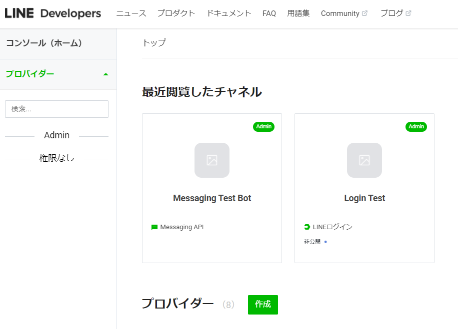
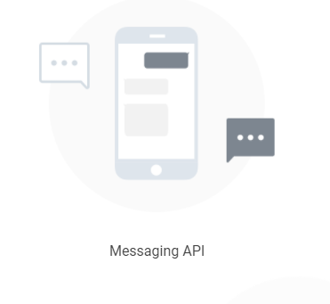

# Functionsの作成
## Functionsリソース作成
- リソースグループを作成
- 作成したリソースグループへ移動
- 上部「作成」からリソースの作成画面へ移動
- 検索窓に「Functions」と入力して、候補の中の「Function App」を選択
- Functionsのアイコンが表示されている画面へ移動したらアイコンの右下付近にある「作成」ボタンを押下
- 作成に必要な内容を記入して作成
- リソースが作成されたら次の工程へ！

## LINEチャネル作成
- 【無ければ】プロパイダー作成  
  

- プロパイダーのメニュー画面へ移動し
- 新規チャネル作成 → LINEログイン  

  - チャネル名とチャネル説明を入力
  - アプリタイプを「Webアプリ」に設定
  - LINE開発者契約に同意して作成
- 新規チャネル作成 → Messaging API  

  - チャネル名とチャネル説明を入力
  - 大業種：ウェブサービスを選択
  - 小業種：ウェブサービス（その他）を選択
  - LINE公式アカウント利用規約とLINE公式アカウントAPI利用規約に同意して作成
- Messaging APIの設定
  - 上部タブの「Messaging API設定」へ移動  
    
  - 以下の項目を編集する
    - webhook
      - Functionsの設定からURL取得
      - "取得したURL"/api/webhookを設定
    - 応答メッセージを無効
    - あいさつメッセージを無効

## 環境変数にチャネルアクセストークン設定
- 先程作成したMessaging APIへ移動
- Messaging API設定へ移動
- 最下部にある「チャネルアクセストークン」をコピー
  - まだ発行してない場合は「発行」ボタンを押下してコピー
- 先に作成しておいたFunctionsのリソースへ移動
- リソース画面の左サイドメニューにある設定→構成へ移動
- アプリケーション設定に「新しいアプリケーション設定」を追加
  - 名前：LINE_CHANNEL_ACCESS_TOKEN
  - 値：コピーしたチャネルアクセストークン
  - デプロイスロットの設定にチェック
- 新しく追加されたことを確認したら保存
  - ※保存完了までしばらくかかるので待機

## デプロイ
- GitHubからソースコードを取得
  - [GitHub - alterbooth/hol-azure-line-bot](https://github.com/alterbooth/hol-azure-line-bot)
- [Visual Studio Code を使用して C# 関数を作成する - Azure Functions \| Microsoft Docs](https://docs.microsoft.com/ja-jp/azure/azure-functions/create-first-function-vs-code-csharp)
- 上記を参考に作成したリソースに対してデプロイを行う

## 動作確認
- 作成したLINEアカウントに対してなにか発言して同じ内容が返ってくればOK
