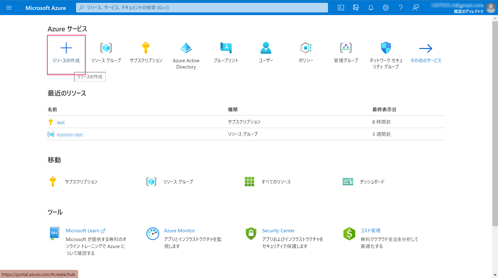
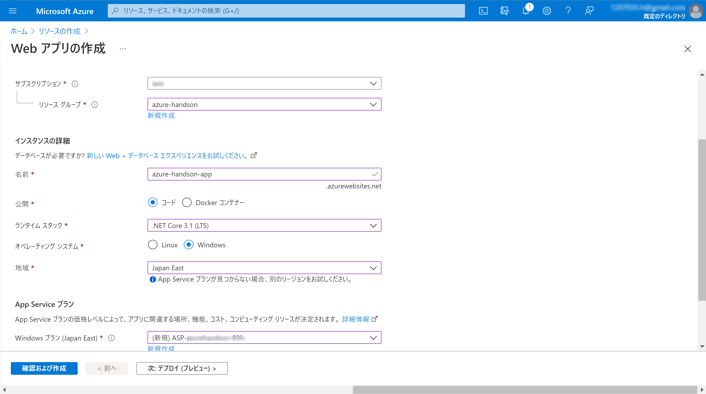
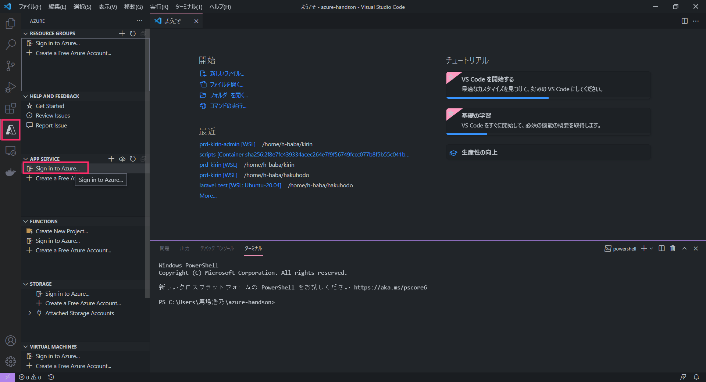

# Webアプリの作成
## Web Appsリソース作成
1. ポータル画面にログイン
1. 「リソースの作成」をクリック  

1. 「Webアプリ」をクリック  

1. 以下のように選択
    - サブスクリプション：{無料使用枠}  
    - リソースグループ：{functionsで作成したものを選択}  
    - 名前：{任意のユニーク文字列}  
    - 公開：コード  
    - ランタイムスタック：.NET Core 3.1(LTS)  
    - オペレーティングシステム：Windows  
    - 地域：Japan East または Japan West（リソースグループと同じ方）  
    - Windowsプラン：「(新規)ASP-xxxxx」を選択  
  
1. SKUとサイズ：「サイズを変更します」をクリック→「開発/テスト」タブから「F1（無料プラン）」を選択  

1. 「確認および作成」→「作成」をクリック
1. リソース作成完了（少し時間がかかります）

## サンプルコードのデプロイ
1. VSCodeのターミナルを開き、 `Web` ディレクトリに移動
1. `dotnet publish -c Release -o ./publish` コマンドを実行
1. 左ツールバーのAzureアイコンをクリックし、「App Service」→「Sign in to Azure」からアカウントを選択  

1. 今回使用しているサブスクリプションを選択  
1. 先ほど作成したApp Serviseを選択し、右クリック→「Deploy to Web App」を選択  
  
1. 「Browse」から先程作成した **publish** フォルダを選択
1. 警告画面が出たら、「Deploy」をクリック  
  
1. 「Browse Website」を選択し、アプリが表示されたらデプロイ完了  

**確認できたら、次のステップ[Webアプリの更新](./web-update.md)へ進みます。**
