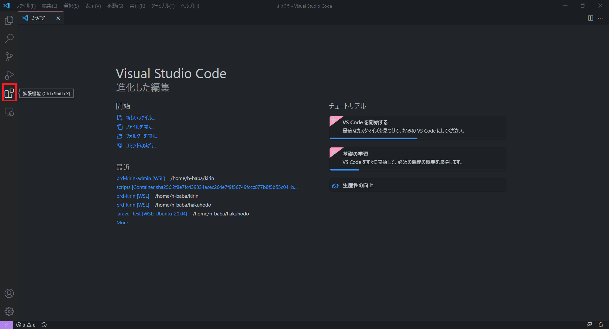
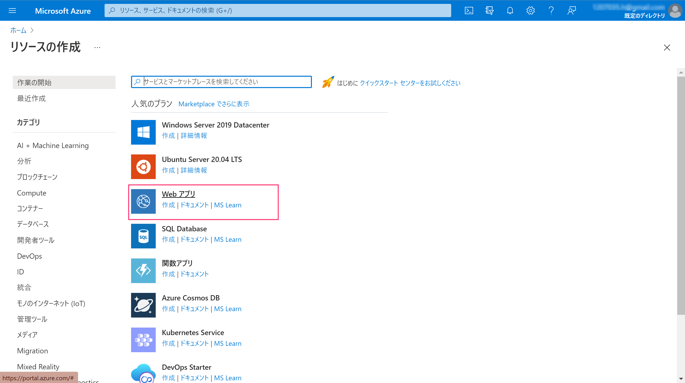
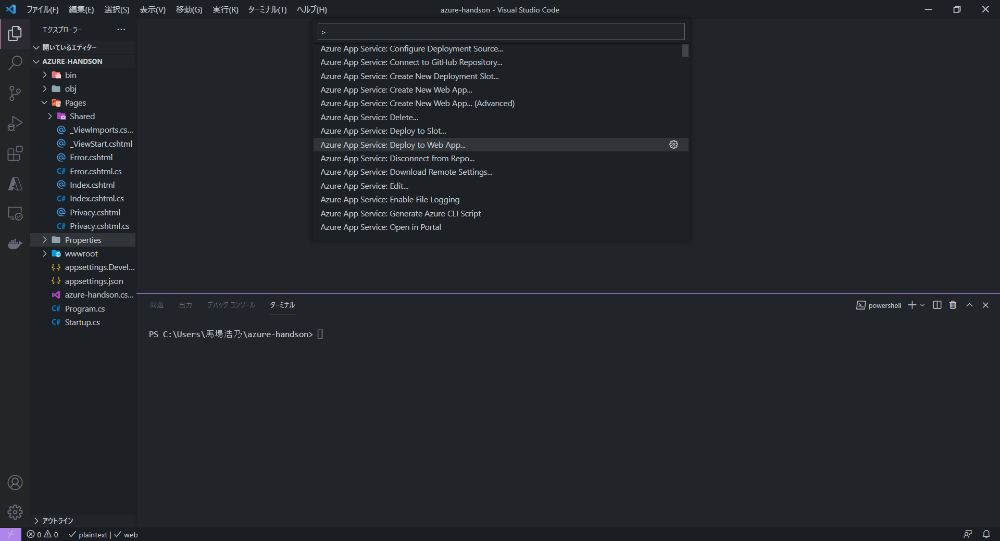
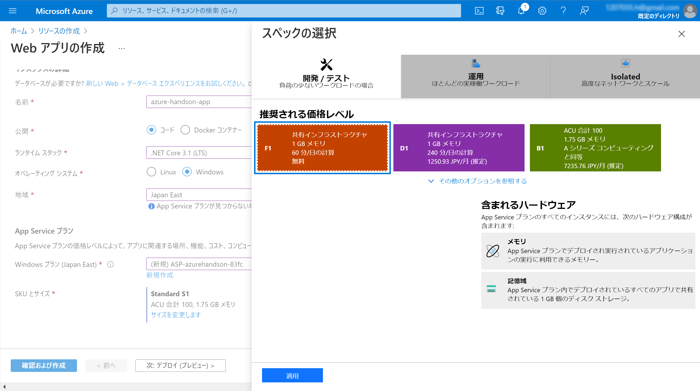
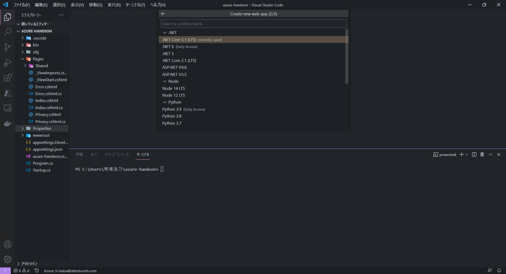
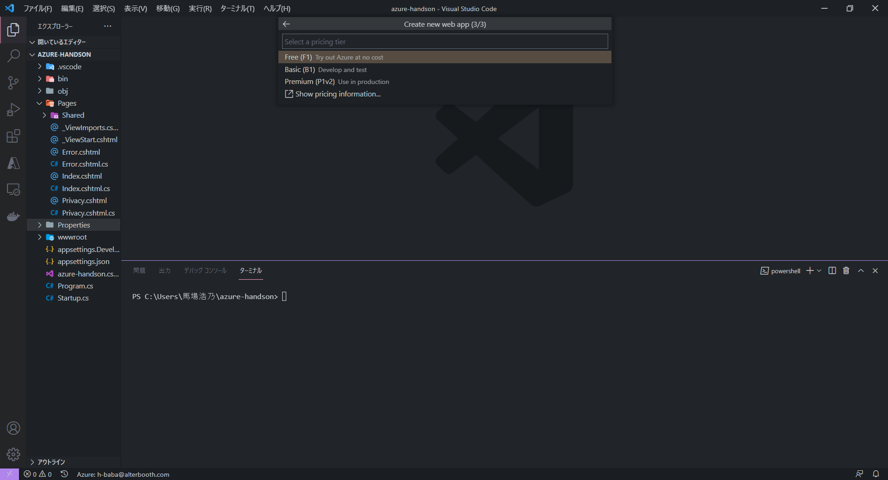
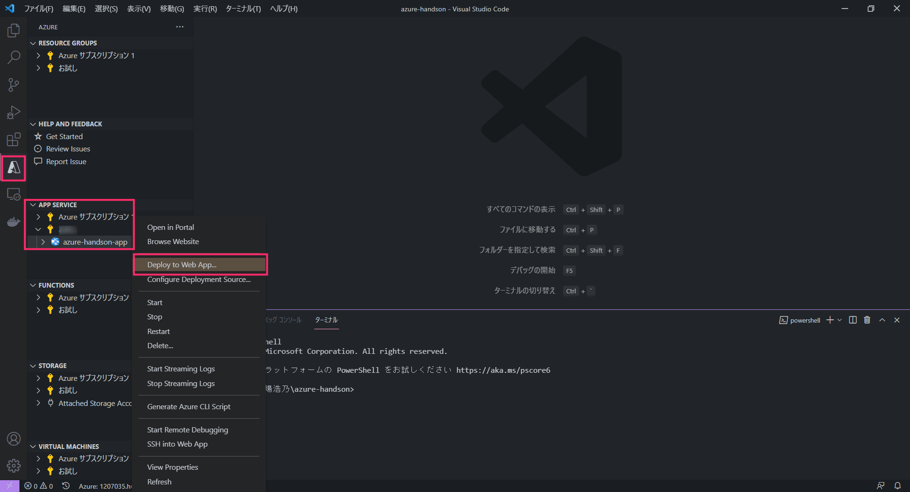
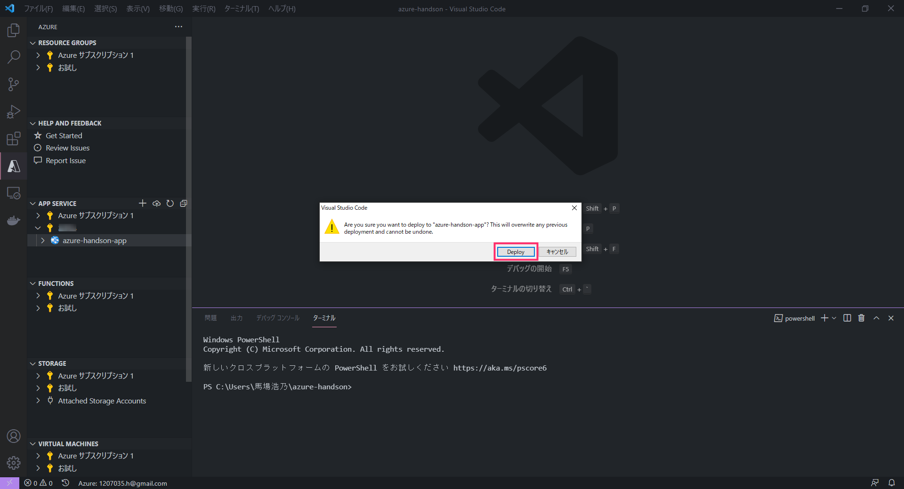

# Webアプリの作成
  
## Web Appsリソース作成  
1. ポータル画面にログイン  
2. 「リソースの作成」をクリック  
  
3. 「Webアプリ」をクリック  
  
4. 以下のように選択  
   - サブスクリプション：{無料使用枠}  
   - リソースグループ：{functionsで作成したものを選択}  
   - 名前：{azure-handson-app}  
   - 公開：コード  
   - ランタイムスタック：.NET Core 3.1(LTS)  
   - オペレーティングシステム：Windows  
   - 地域：Japan East  
   - Windowsプラン：「(新規)ASP-xxxxx」を選択  
  
5. SKUとサイズ：「サイズを変更します」をクリック→「開発/テスト」タブから「F1（無料プラン）」を選択  
  
6. 「確認および作成」→「作成」をクリック  
7. リソース作成完了（少し時間がかかります）  

## Azure Tools(拡張機能)をインストールする   
Visual Studio Codeを開き、「拡張機能」をクリック
  
検索フィールドに「Azure tools」と入力し、「インストール」をクリック
  
  
## サンプルコードのデプロイ  
1. 左ツールバーのAzureアイコンをクリックし、「App Service」→「Sign in to Azure」からアカウントを選択  

2. 今回使用しているサブスクリプションを選択  
3. 先ほど作成したApp Serviseを選択し、右クリック→「Deploy to Web App」を選択  
  
4. 警告画面が出たら、「Deploy」をクリック  
  
5. 「Browse Website」を選択し、アプリが表示されたらデプロイ完了  
**確認できたら、次のステップ[Webアプリの更新](./web-update.md)へ進みます。**

